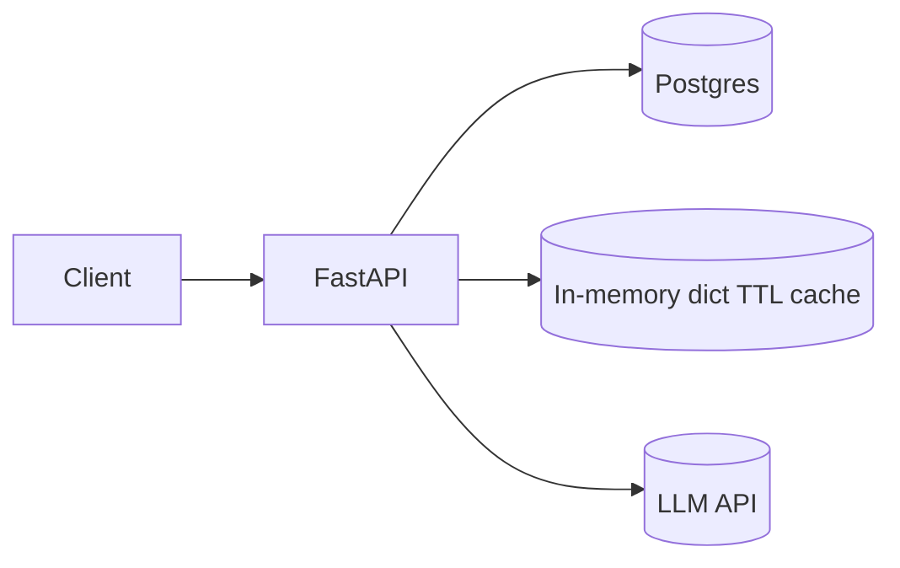
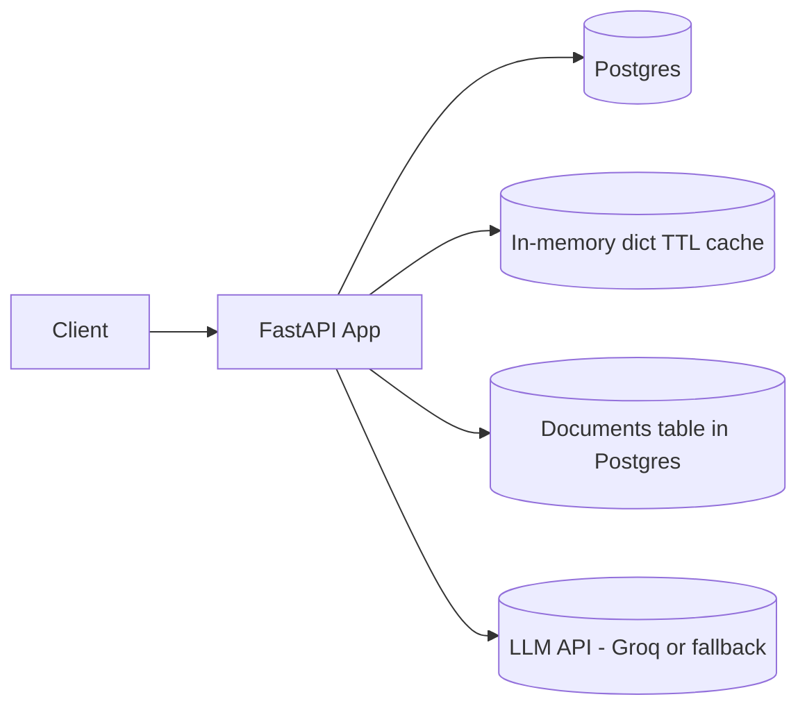
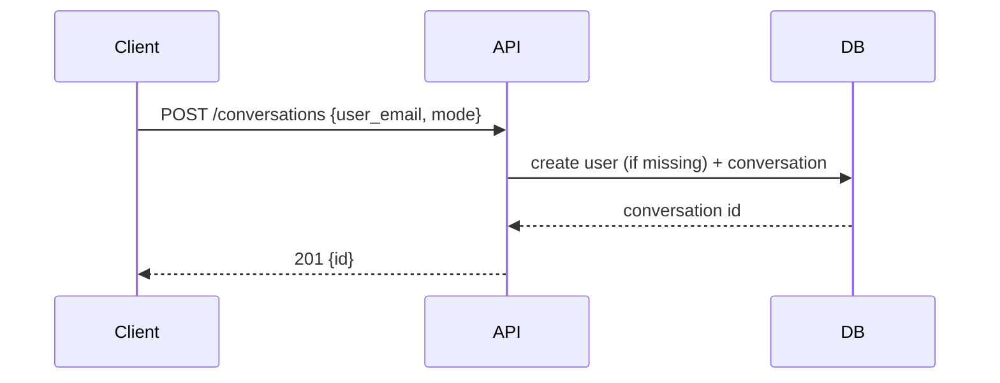
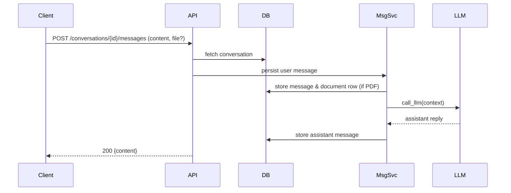

# BOT GPT — Demo Presentation

Target: a short, time-boxed demo document with architecture diagrams (Mermaid) and concise talking points.

Total time: ~30–35 minutes (per your breakdown)

1) Problem overview & my understanding — 5 min
- Problem: provide a lightweight backend that supports conversational LLM chat and RAG (PDF ingestion) with low-latency message handling and token-cost control.
- Key goals: persistent conversations, PDF ingestion for RAG, affordable LLM usage, simple ownership/auth, and easy local dev.
- What we deliver: FastAPI app, SQLAlchemy models, simple in-memory TTL cache, PDF extraction, simple DB-backed retriever, async LLM wrapper.

2) Arch basic — 2–3 min
- Quick mental model: client -> API -> DB + cache -> LLM
- Early sketch (initial thought):

3) Final flow — 5 min
- Final Arch (precise):

- Final APIs (short):
  - POST /conversations — create conversation (user_email, mode=open|rag)
  - GET /conversations?user_email=... — list
  - GET /conversations/{id} — detail
  - DELETE /conversations/{id} — delete (ownership enforced via X-User-Email)
  - POST /conversations/{id}/messages — send message; optional PDF file (only in `rag` mode)

- Data models & caching (short):
  - `users`, `conversations`, `messages`, `documents`, `conversation_documents` in Postgres
  - `messages` append-only; use `seq` or created_at for ordering
  - cache: simple dict TTL in `app/db/cache.py` for conversation lookups and reduced DB reads

- LLM Layer: LLM Context & Cost Management
  - Context constructed as: system prompt + recent raw messages (sliding window) + RAG chunks (if rag) + latest user message
  - When history grows: use windowing + periodic summarization (summaries stored as `system` messages)
  - Cost controls: shorter `max_tokens`, cheaper model for summarization, caching responses

- Caching
  - In-memory dict TTL cache (default TTL env var) — thread-safe, invalidated on writes
  - Keeps hot conversation objects to reduce read pressure

- How RAG works here
  - PDF ingestion: extract text, chunk, store chunks in `documents` table linked to conversation
  - Retrieval: simple substring / heuristic-based retriever in `rag_service` returns top_k chunks
  - No vector DB in this implementation; vector DB can be added later for higher recall/scale

- Cost saving calls in design
  - Summarize older history periodically (background worker recommended)
  - Keep only last N raw messages in context + summary of older history
  - Limit max_tokens and use cheaper models where appropriate
  - Cache identical prompts/replies

- Scaling & bottlenecks
  - Bottlenecks: LLM throughput/cost, DB writes/reads, document retrieval
  - Scale app horizontally (stateless FastAPI), add read replicas and partition/shard message stores
  - Use background workers for embeddings/summaries and queue LLM calls when needed

4) Demo — Testing — 10 min
- Quick test plan (10 minutes):
  1. Start app locally: `uvicorn app.main:app --reload` (ensure `.env` with GROQ_API_KEY)
  2. Create conversation (RAG): POST /conversations (curl example in README)
  3. POST a message with PDF to `/conversations/{id}/messages` and confirm stored document
  4. POST a follow-up message; verify assistant reply (mocked LLM in tests)
  5. Inspect DB: `messages`, `documents`, `conversation_documents`

Mermaid for the two demo endpoints (ready to paste):

POST /conversations

POST /conversations/{id}/messages (with optional PDF)

5) Tradeoffs — 2 min
- Simplicity vs recall: DB-backed retriever is simple and cheap but less accurate than vector search.
- Cost vs freshness: Summaries reduce token cost but lose granular detail.
- Local in-memory cache is simple but not shared across instances — swap to Redis if multi-instance.

6) Future improvements — 5 min
- Add vector DB for semantic retrieval (Pinecone/Weaviate) and async embedding pipeline
- Background worker for summarization and embedding (Celery/RQ/Kafka + workers)
- Add rate-limiting and quotas, streaming responses for LLMs, and per-user cost controls
- Add e2e tests and a small frontend to demo UX

---

Notes: use the Mermaid snippets above on mermaid.live to export PNG/SVG for slides.

File: `docs/presentation.md`
